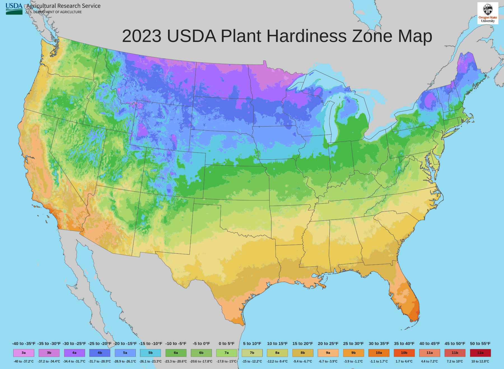

# Zone Pusher — 2023 USDA Plant Hardiness Zone Map

A plotting-ready, editable Lower 48 version of the **2023 USDA Plant Hardiness Zone Map**.

This project is intended for people who want a clean base map they can use to plot cities, weather stations, plants, climate observations, or other location-based information without having to rebuild the USDA hardiness zone map from scratch.

## What makes this map different?

The hardiness-zone geography was not redrawn or approximated by AI.

The underlying 2023 USDA/PRISM plant hardiness zone information is preserved while the map has been prepared as a clean, editable SVG base layer. The goal is to separate the **hardiness-zone map itself** from whatever information you want to plot on top of it.

That means you can add your own:

- Cities and locations
- Weather stations
- Plant observations
- Freeze/frost information
- Climate data
- Labels and annotations
- Custom title

without having to permanently bake those additions into the base map.

## Files

### Editable SVG
The SVG is the primary file. Use this if you want to customize the map or add your own plotted information.

### PNG Preview
The PNG provides a quick preview of the finished base map without requiring SVG-compatible software.

## About the data

Plant hardiness zones represent the average annual extreme minimum temperature for an area.

The hardiness-zone information in this project is derived from the **2023 USDA Plant Hardiness Zone Map**, produced by the USDA Agricultural Research Service using PRISM climate data.

This repository is a redistribution/presentation of the map for easier plotting and customization. It is not a new hardiness-zone model and does not independently recalculate USDA zones.

## Intended use

Download the SVG, open it in an SVG-compatible graphics or mapping application, and use it as your base layer.

Plot whatever you want on top of it.

---

**PalmGoblin**
